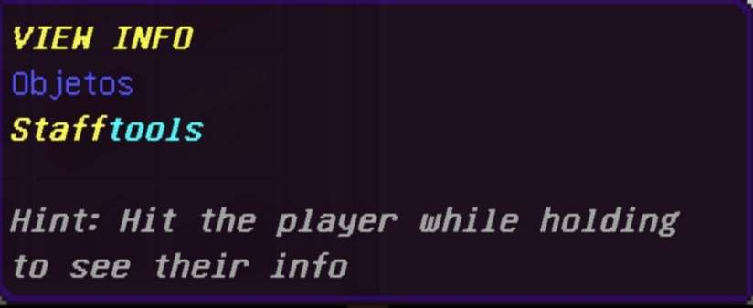
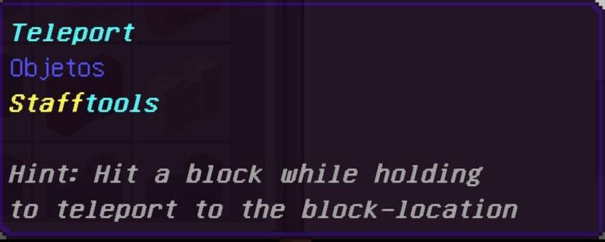

# STAFF-TOOLS
STAFF TOOLS is an addon for [MINECRAFT BEDROCK](https://www.microsoft.com/es-ec/p/minecraft-for-windows/9nblggh2jhxj?activetab=pivot:overviewtab) which has the simple utility of allowing you to control the members of your server / world / realm in a much easier way.

## HOW TO SETUP
To use **STAFF TOOLS** you simply have to add the **"Admin"** tag which will allow you to execute the command to activate **staff mode**. And this brings us to the second important thing. The command:

In order to activate staff mode you must use the command **"?staffmode"** or **"?stm"**, **"?"** is the prefix and **"staffmode"** is the command.

**_Note: When you activate the staffmode command all items in your inventory will be removed and you will get all staffmode items and staffmode benefits. When you deactivate staffmode, all lost items will be returned to you except for the items that were in the armor and off-hand slots._**

## ITEMS
-**FREEZE**: This item will allow you to freeze a player just by hitting him with the item, to unfreeze him you will have to hit him again. This item is represented with an ice cube.  
**HIT PLAYER TO USE**  

-**INFO**: This item will allow you to see various data about a player, such as their health level, their exact position, their speed, and their freeze status. This item is represented with a normal book (There are few things since STAFF TOOLS is still a simple beta).  
**HIT PLAYER TO USE**  

-**KILL**: This item allows you to kill a player even when they are in creative mode. This item is represented with a barrier.  
**HIT PLAYER TO USE**  

-**SMITE**: This item will allow you to damage a player with lightning. This item is represented with a rod of blaze  
**HIT PLAYER TO USE**  

-**SMITE AND KILL**: You can change the item (KILL AND SMITE) using the right click, if you right click having the kill item, it will change to the smite item and if you have the smite item and you right click it, it will change to the kill item.  
**RIGHT-CLICK TO USE**  

-**RANDOM-TELEPORT**: This item will teleport you to a random player. This item is represented with a compass.  
**RIGHT-CLICK TO USE**  

-**VANISH**: This item allows you to become totally invisible, it will even make your armor and the items you have in your hand not visible!. This item is represented as a watch.  
**RIGHT-CLICK TO USE**  

-**CLICK-TELEPORT**: This item allows you to teleport the block you touch with the item in your hand. This item is represented with a paper.  
**RIGHT-CLICK TO USE**  

## BENEFITS:
 

-Night vision effect (**Vanish benefit**)

-Invisibility effect (**Vanish benefit**)

-Invisible armor and invisible hand items (**Vanish benefit**)

<h3>Download</h3>

